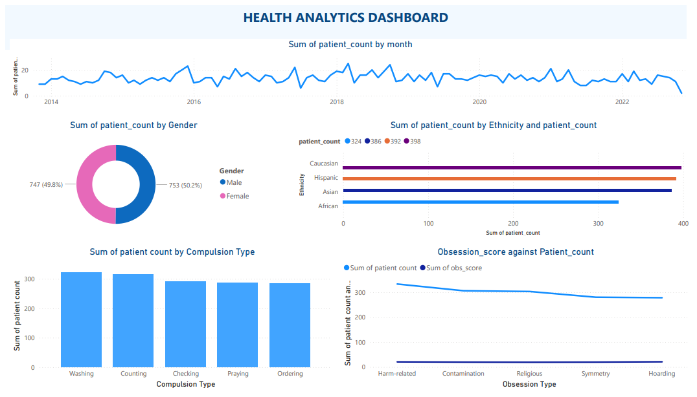
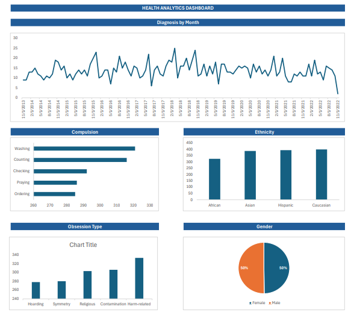

This guided project focused on visualizing SQL findings of OCD patients. It introduced me to the workflow of transforming SQL queries into meaningful visualizations to present insights using both Power BI and Excel.

- [Power BI Visualization PDF](./Visualizations/PowerBi_viz.pdf)  
  

- [Excel Visualization PDF](./Visualizations/Excel_viz.pdf)  
  
